<!--
  ✨ Profile README for github.com/rohit-negi69
  Repo must be named exactly: rohit-negi69   (public)
  The file assets/banner.svg ships with this repo.
-->

 

<!-- 👉 LinkedIn: create your profile, replace YOUR-HANDLE below, then delete this comment block.

-->

---

## 👋 About me

I'm a **Machine Learning Engineer** who cares about the last mile — not just training a model, but shipping it as something a real person can open, click and actually use.

- 🌿 **Latest build — [PlantGuard AI](https://github.com/rohit-negi69/Plant_Guardian_Disease_Prediction):** real-time plant-disease detection running **in the browser** (TensorFlow.js MobileNetV2, 38 disease classes), fused with a **local vision LLM** (Ollama) and a **248-chunk MongoDB RAG** cure engine — with an audit layer that rejects confident-but-wrong CNN labels.
- 🏆 **Hackathon build — [CarbonPulse](https://github.com/rohit-negi69/Carbon_Pulse_Co2_tracker_Hackathon):** real-time carbon-footprint tracker with **bidirectional WebSockets**, an AI copilot, GHG-protocol scope splits and **68/68 backend tests passing**.
- 🧠 **Explainability first — [Employee Attrition Platform](https://github.com/rohit-negi69/Intelligent_Employee-Attrition-Prediction-and-Retention-Management-System):** an ExtraTrees model (**85.0% accuracy · 77.3% ROC-AUC**) wrapped in a Flask app that turns risk scores into plain-English retention actions — and I cut the deployed model from **61 MB → 2.6 MB** so it fits a free serverless tier.
- 🚀 **I ship to production:** 3 of my projects are live on Vercel right now — one of them a **Streamlit + KNN recommender over 232,725 Spotify tracks**.
- 🌱 **Currently exploring:** retrieval-augmented generation, on-device inference, and MLOps on serverless runtimes.
- 💬 **Ask me about:** scikit-learn, TensorFlow/Keras, Flask, Next.js, or making a 61 MB model fit inside 354 MB.

## 🚀 Featured projects

<table>
<tr>
<td width="50%" valign="top">

### 🌿 PlantGuard AI
**Real-time plant disease detection + grounded cure plans, running entirely on your machine.**

- In-browser CNN (TensorFlow.js MobileNetV2, **38 PlantVillage classes**) — images never leave the device
- **Four-source ensemble:** whole-leaf CNN + lesion-zoom CNN + local vision LLM (Ollama llava) + measured pathology features
- **Hallmark audit** demotes diagnoses that fail their defining traits — stops confident field-photo mislabels
- Retrieval-augmented cure plans with citations from a **248-chunk MongoDB agronomy knowledge base**
- Live weather-driven disease-risk forecasting (Open-Meteo)

`Next.js 14` · `TypeScript` · `TensorFlow.js` · `MongoDB` · `Ollama` · `RAG`

</td>
<td width="50%" valign="top">

### 🌱 CarbonPulse
**Hackathon build — turns daily choices into a visible carbon footprint, in real time.**

- **Bidirectional WebSocket** channel: server pushes entries, targets and nudges; the same socket carries commands back
- Sequence-numbered, buffered frames → a dropped connection replays exactly what it missed
- Dashboard, weekly targets with pace verdicts, GPS trip tracker, **AI copilot**, CSV export
- GHG-protocol **scope 1/2/3 splits** and a reduction modeller that quantifies a swap before you commit
- **68/68 backend tests passing** · zero-auth demo mode for graders

`Node.js` · `JavaScript` · `WebSockets` · `Vercel`

</td>
</tr>
<tr>
<td width="50%" valign="top">

### 📊 Employee Attrition Prediction & Retention
**Explainable HR analytics that predicts who is about to leave — and what to do about it.**

- **ExtraTrees classifier: 85.0% accuracy · 77.3% ROC-AUC** on the IBM HR dataset
- Predictions paired with targeted, plain-English retention recommendations
- Plotly dashboards (attrition, department, salary, satisfaction, trends), CSV import, PDF/CSV report export
- Role-based access, admin CRUD and a documented **REST API**
- **Engineering win:** slimmed the deployed model from **61 MB to 2.6 MB** and the bundle from 1 GB+ to 354 MB — deploy time 15 min → ~1 min

`Python` · `Flask` · `scikit-learn` · `Plotly` · `SQLite/MySQL` · `Vercel`

</td>
<td width="50%" valign="top">

### 🎶 Spotify Music Recommender
**Content-based recommendations across 232,725 tracks.**

- Unsupervised **K-Nearest Neighbors** over 8 audio features (danceability, energy, valence, tempo, acousticness, instrumentalness, liveness, speechiness)
- **Streamlit** UI with fuzzy song matching, live album art, 30-second previews and one-click "Open in Spotify"
- EDA notebook: popularity distributions, feature-correlation heatmap, danceability vs. energy
- Fully **Dockerised** — one-command reproducible deployment

`Python` · `scikit-learn` · `Streamlit` · `Spotipy` · `Docker`

</td>
</tr>
</table>

## 🧰 Also on my GitHub

| Project | What it is | Stack |
| :-- | :-- | :-- |
| [**RN_Portfolio**](https://github.com/rohit-negi69/RN_Portfolio) ·  | Portfolio site with particle-network background, typewriter hero, 3D tilt cards and a **fully local AI chatbot** that answers questions about my resume (fuzzy matching, follow-up memory, no API keys) | `HTML` `CSS` `JavaScript` |
| [**Rain_predict_-23**](https://github.com/rohit-negi69/Rain_predict_-23) ⭐ | Rainfall prediction from weather parameters using a **GridSearchCV-tuned Random Forest** (81% cross-validated accuracy) with imputation, downsampling and a reusable pickle model | `Python` `scikit-learn` `Seaborn` |
| [**cats-vs-dogs-classification**](https://github.com/rohit-negi69/cats-vs-dogs-classification) | Image classification with a **TensorFlow/Keras CNN** trained on the Kaggle Cats vs Dogs dataset | `TensorFlow` `Keras` |
| [**PRODIGY_ML_02**](https://github.com/rohit-negi69/PRODIGY_ML_02) | Retail-store **customer segmentation** with K-Means clustering | `scikit-learn` |
| [**PRODIGY_ML_04**](https://github.com/rohit-negi69/PRODIGY_ML_04) | **Hand-gesture recognition** via CNN image classification | `OpenCV` `CNN` |

---

## 🛠️ Tech stack

**Languages**

**Machine learning & deep learning**

**Web, APIs & real-time**

**Data, storage & tooling**

---

## 📊 GitHub in numbers

<!-- ============================================================================
     OPTIONAL STATS (currently DISABLED on purpose)
     The three popular services below are returning 503 / 402 for their free
     public instances right now, which would show broken images to recruiters.
     Flip them back on if they recover, or point them at your own 2-minute
     Vercel deployment (self-hosting also unlocks the full card set).

     ============================================================================ -->

---

## 🎯 What I'm looking for

I'm open to **Machine Learning Engineer / Data Scientist / Applied AI Engineer** roles where I can take a model from notebook → API → interface → production, and where explainability actually matters.

**📫 Reach me:** [rnegilxm16@gmail.com](mailto:rnegilxm16@gmail.com) · **[Portfolio](https://rn-portfolio-pied.vercel.app)** · **[All repositories](https://github.com/rohit-negi69?tab=repositories)**

 

